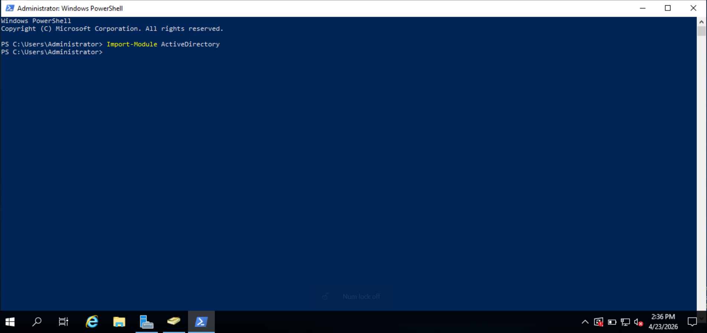
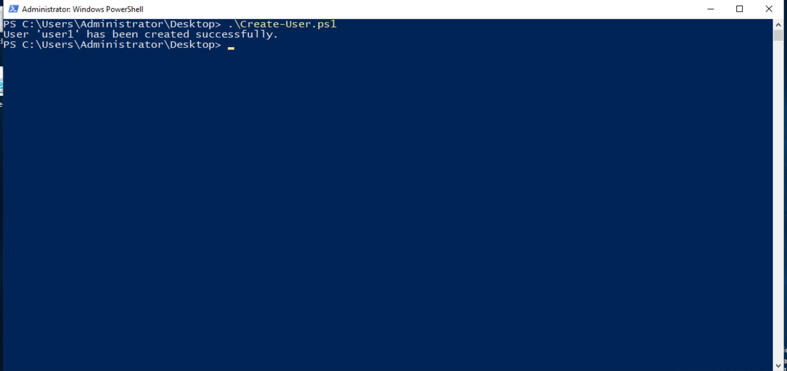
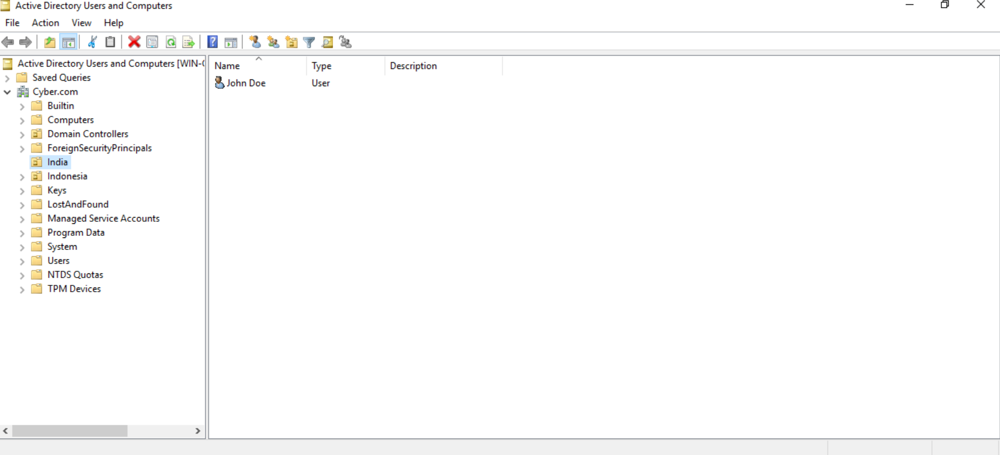
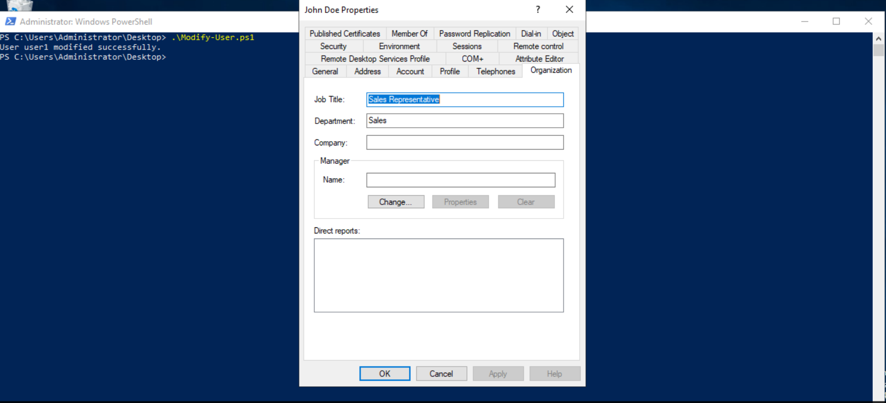
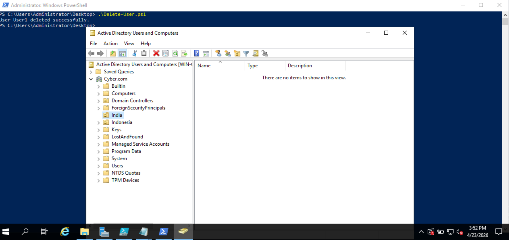
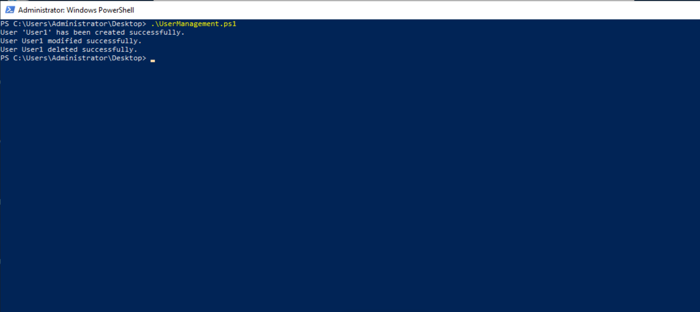

# Automated User Management with PowerShell
This project demonstrates automated user lifecycle management in Active Directory using PowerShell. It focuses on Identity and Access Management (IAM) concepts such as user provisioning, modification, and deprovisioning.

The automation reduces manual effort, improves consistency, and reflects real-world enterprise user management practices.

## Table of Contents

### Project Goals
- Streamline User Management: Automate repetitive Active Directory user management tasks to improve administrative efficiency.
- Enhance Efficiency: Minimize manual effort and reduce time spent on user account operations through automation.
- Ensure Consistency: Maintain standardized and consistent user account configurations across the organization. 

### Features
- User Creation: Automate the provisioning of new user accounts in Active Directory using PowerShell.
- User Modification: Update and manage user attributes such as title, department, and email efficiently.
- User Deletion: Securely deprovision and remove user accounts from Active Directory.

### Prerequisites
To use these scripts, the following prerequisites are required:

- A system running Windows Server or Windows 10 with Remote Server Administration Tools (RSAT) installed
- Active Directory Module for Windows PowerShell
- Appropriate administrative permissions to perform user management tasks in Active Directory

### Usage Instructions
### Step 1: Import the Active Directory Module
Before executing any scripts, import the Active Directory module to access the required cmdlets.
```powershell
Import-Module ActiveDirectory
```
### Screenshot:



### Step 2: Create a New User

Run the user creation script to add new users to Active Directory. This step involves specifying user details such as username, password, and organizational unit (OU).
```
# Create-User.ps1

# Parameters
param (
    [string]$Username   = "user1",
    [string]$Password   = "Password@123",
    [string]$FirstName  = "John",
    [string]$LastName   = "Doe",
    [string]$OU         = "OU=Users,DC=example,DC=com"
)

# Import Active Directory Module
Import-Module ActiveDirectory

# Create new user in Active Directory
New-ADUser -SamAccountName $Username `
           -UserPrincipalName "$Username@example.com" `
           -Name "$FirstName $LastName" `
           -GivenName $FirstName `
           -Surname $LastName `
           -Path $OU `
           -AccountPassword (ConvertTo-SecureString $Password -AsPlainText -Force) `
           -Enabled $true

# Confirmation message
Write-Host "User '$Username' has been created successfully."
```
## Run command:
```
.\Create-User.ps1
```
### Screenshot:




### Step 3: Modify User Attributes
After creating a user, their attributes can be modified. This script updates user details to keep information accurate and up to date.

```
# Modify-User.ps1

# Parameters
param (
    [string]$username = "User1",
    [string]$title = "Sales Representative",
    [string]$department = "Sales"
)

# Import Active Directory Module
Import-Module ActiveDirectory

# Modify the user
Set-ADUser -Identity $username `
           -Title $title `
           -Department $department

Write-Host "User $username modified successfully."
```
## Run command:
```
.\Modify-User.ps1
```
### Screenshot:


### Step 4: Delete a User Account
When a user leaves the organization or no longer requires access, use this script to remove their account from Active Directory.

```
# Delete-User.ps1
param (
    [string]$username = "User1"
)

Import-Module ActiveDirectory

Remove-ADUser -Identity $username -Confirm:$false

Write-Host "User $username deleted successfully."
```
## Run command:
```
.\Delete-User.ps1
```
### Screenshot:


### Step 5: Full User Management Workflow
For complete user lifecycle management, you can run a master script that performs user creation, modification, and deletion in sequence, simplifying bulk operations.
```
# UserManagement.ps1

# Import Active Directory Module
Import-Module ActiveDirectory

# Create User
.\Create-User.ps1 -username "User1" -password "Password@123" -firstName "John" -lastName "Doe" -OU "OU=india,DC=Cyber,DC=com"

# Modify User
.\Modify-User.ps1 -username "User1" -title "Sales Representative" -department "Sales"

# Delete User
.\Delete-User.ps1 -username "User1"
```
## Run Command:
```
.\UserManagement.ps1
```
### Screenshot:


## Troubleshooting
### 1. Active Directory Module Not Loaded
- Issue: The script fails with commands not recognized.
- Solution: Ensure the Active Directory module is imported:
  ```
  Get-ADOrganizationalUnit -Filter *
  ```
### 2. Directory Object Not Found
- Issue: New-ADUser fails with "Directory object not found."
- Solution:
    Verify the Organizational Unit (OU) exists using:
  ```
  Get-ADOrganizationalUnit -Filter *
  ```
- Ensure the Distinguished Name (DN) format is correct: OU=Users,DC=yourdomain,DC=com.

### 3. Permissions Issue
- Issue: The script fails due to insufficient permissions.
- Solution: Run PowerShell as an Administrator and ensure the executing account has the necessary privileges to create users in the specified OU.
### 4. Password Policy Violation
- Issue: User creation fails due to the password not meeting requirements.
- Solution: Ensure the password meets your domain's complexity requirements (e.g., length, characters).

### Summary
This project demonstrates automated Active Directory user lifecycle management using PowerShell, improving operational efficiency and ensuring consistent, accurate identity management practices.


